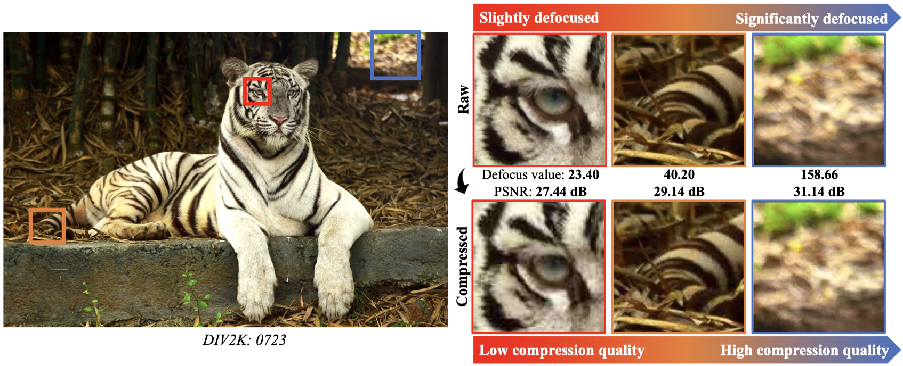

# 论文速览：感知图像失焦特性的压缩图像质量增强（TPAMI'23）

论文标题：*DAQE: Enhancing the Quality of Compressed Images by Exploiting the Inherent Characteristic of Defocus*

论文链接：https://arxiv.org/abs/2211.10984

本文提出了一种感知图像失焦特征的压缩图像增强方法（Defocus Aware Quality Enhancement，DAQE），是首个考虑压缩图像内部质量差异的增强算法。DAQE 方法体现了笔者课题组继资源节约型盲增强方法（Resource-Efficient Blind Quality Enhancement，RBQE）[^rbqe]之后，针对压缩图像细粒度增强的新思考。

## 图像细粒度增强是大势所趋

图像质量增强是一个经典且实用的图像恢复任务。笔者课题组长期关注其中的一个子课题：压缩图像的质量增强，主要考虑到三点优势：（1）可以在图像接收端提升用户体验；（2）可以在质量一定的条件下，降低压缩码率，从而降低通信成本；（3）可以提升下游任务精度。

近年来深度学习网络展现出优异的性能，因此本文也聚焦于「基于深度学习的质量增强方法」。相关方法通常是针对整张图进行操作的，即不考虑图像内部的质量和纹理差异。考虑图像内部差异的典型方法包括：

1. 将图像在空域上分为纹理（texture）、边缘（edge）和平坦区域（flat/smooth area），然后分而治之。这是因为在统计上，前两者的增强难度比平坦区域的要大得多。代表工作有参考文献[^divide]。
2. 设计一个多分支网络，然后学习一个分支决策器，让图像增强难度各异的区域经过不同的增强分支。通常不同分支具有不同的计算复杂度。例如，Path-Restore 方法[^path]基于训练损失和强化学习方法得到分支决策器，而 ClassSR 方法[^classsr]基于预先计算的 PSNR 结果和难度三分类损失函数。这一类方法往往会得到和上一类方法相似的结论，即增强困难区域往往是纹理和边缘区域。

笔者认为，这种考虑图像内部差异的细粒度增强是大势所趋。一方面，细粒度增强可以节约计算资源，即在简单的区域简单增强；另一方面，细粒度增强可以实现更具有针对性的定制化增强，即针对不同的物体、纹理或特征执行特定的增强。

## 如何判断增强难度——图像失焦先验

上述相关工作可以迁移到压缩图像增强任务上，但还是过于复杂了。笔者在思考，是否存在一种针对「压缩图像质量增强」具有重大意义的图像底层特征或先验知识。笔者的思考是受到了经典的视频插帧算法 DAIN（Depth-Aware Video Frame Interpolation）[^dain]的启发。在 DAIN 中，作者巧妙利用了图像深度信息，使得有遮挡情况下的视频插帧结果更加合理。

笔者给出的答案是「图像失焦」特征。这一特征具有很多好的性质：

1. 图像失焦是图像成像阶段固有的光学畸变过程，是自然图像中普遍存在的光学特征。并且，图像失焦也是一项非常成熟的渲染技术，也被广泛用于生成图像。经过分析，大部分数据集，尤其是摄影数据集（例如 DIV2K 数据集），其中的图像都具有非常显著的图像内部失焦差异。即，图像内部不同区域的失焦程度差异较大。这种差异性为全文基于失焦差异的增强奠定了基础。
2. 图像失焦产生了类似低通滤波器的效果。即，失焦越严重的区域，高频细节丢失得越多。在图像压缩时，这一类区域的压缩质量通常较高，因为更好压缩。这一相关性为之后的基于压缩质量的提前退出策略奠定了基础。
3. 因为性质 2，失焦程度相似的区域，其纹理也更相似。这一相关性为之后的分治策略奠定了基础。
4. 作为一个底层图像特征，图像失焦还在一定程度上反映了高级视觉特征，例如视觉注意力。因为对于摄影师而言，失焦区域往往是视觉非热点区域，聚焦区域往往是视觉热点区域。因此，已经有文献[^saliency]借助图像失焦检测图像显著性。这体现了图像失焦特性在图像处理领域的巨大潜力。

笔者重点考察了前三点性质，参见原文第三章。

## 感知图像失焦特性的压缩质量增强

在得到压缩图像的失焦预测信息后，本文对图像块根据失焦程度进行聚类，如三类（严重失焦、中等失焦、轻度失焦）。之后，三类图像块分别输入后续的增强网络，经过块拼接后，得到最终的增强图像。

在注意力建模阶段，本文考虑如何将失焦感知引入当前流行的 Transformer 和 CNN 架构。对于 Transformer，本文让每一类图像块单独进行注意力建模，即在类内计算相互注意力；这是考虑到（1）每一类图像块的纹理差异较大，故分而治之；（2）注意力计算较慢，分开建模可以提高效率。对于 CNN，每一类图像块享用独立参数的特征提取模块；这同样是考虑到类间纹理差异较大。

在动态增强阶段，本文扩展了 RBQE 的「提前退出」思路，即严重失焦的图像块走简单分支（因其压缩质量较高），而轻度失焦的图像块走复杂分支。

实验证实了上述设计的合理性。一方面，分治的定制化增强为质量、纹理迥异的图像区域提供了进一步质量增益；另一方面，类内计算降低了计算复杂度和学习难度。实验细节请参见原文第五章。

## 局限性

DAQE 方法主要有以下几点局限性：

1. 图像失焦特征没有 ground truth。为了解决这个问题，DAQE 在训练时利用了 SOTA 的图像失焦预测网络来生成 ground truth；进一步，DAQE 将得到的配对失焦数据用于训练失焦预测子网络。为什么没有直接使用 SOTA 失焦预测网络完成失焦预测？因为 DAQE 的输入图像不是自然图像，而是压缩图像；而已有方法在处理压缩图像时性能下降。
2. 图像失焦预测引入了额外的计算复杂度。
3. 分治策略并不是万能的。当训练数据较少时，或不同类样本数量严重不均衡时，使用分治策略容易导致小样本类别训练不充分。

[^rbqe]: Early Exit Or Not: Resource-Efficient Blind Quality Enhancement for Compressed Images. ECCV 2020.

[^divide]: Component Divide-and-Conquer for Real-World Image Super-Resolution. ECCV 2020.

[^path]: Path-Restore: Learning Network Path Selection for Image Restoration. IEEE TPAMI 2021.

[^classsr]: ClassSR: A General Framework to Accelerate Super-Resolution Networks by Data Characteristic. CVPR 2021.

[^dain]: Depth-Aware Video Frame Interpolation. CVPR 2019.

[^saliency]: Salient Region Detection by UFO: Uniqueness, Focusness and Objectness. ICCV 2013.
